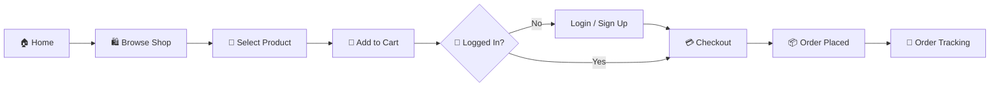

<div align="center">


<br/>

<a href="https://shahrishabh1513-jsk.github.io/Caria/"></a>
<a href="https://github.com/shahrishabh1513-jsk/Caria"></a>
<a href="https://github.com/shahrishabh1513-jsk/Caria/stargazers"></a>

<br/><br/>


<br/>


</div>

<br/>

<table align="center">
<tr>
<td align="center" width="25%"><sub>CATEGORY</sub><br><b>E-Commerce</b></td>
<td align="center" width="25%"><sub>PAGES</sub><br><b>10+</b></td>
<td align="center" width="25%"><sub>BRANDS SHOWCASED</sub><br><b>10+</b></td>
<td align="center" width="25%"><sub>HOSTING</sub><br><b>GitHub Pages</b></td>
</tr>
</table>

<div align="center">

[](#-live-preview)
[](#-about-the-project)
[](#-key-features)
[](#-site-map)
[](#-user-workflow)
[](#️-tech-stack)
[](#-folder-structure)
[](#-getting-started)
[](#-connect)

</div>

<div align="center"></div>

## 🔍 Live Preview

<div align="center">


<sub>Home page hero — see setup note below to add this image to your repo</sub>

<br/>

<a href="https://shahrishabh1513-jsk.github.io/Caria/" target="_blank">
</a>

<sub>👆 Click to explore the live store</sub>

<br/><br/>

<a href="https://shahrishabh1513-jsk.github.io/Caria/" target="_blank">
  
</a>

</div>

> 💡 **Setup note:** Save the attached screenshot as `assets/cara-preview-hero.png` in your repo root so the top preview image renders on GitHub. The second image (below it) is a live auto-updating screenshot and needs no setup.

<div align="center"></div>

## 📖 About The Project

**Cara** is a fully responsive **fashion e-commerce website** built to simulate a real online clothing & accessories store. It covers the complete shopping journey — browsing products, viewing brand collections, managing a cart and wishlist, signing in, and tracking orders — all wrapped in a clean, modern retail-style UI with a soft lavender-and-teal palette.

This project was built to practice real-world **front-end e-commerce architecture**: multi-page navigation, dynamic product displays, cart/account flows, and a fully responsive shopping experience — built entirely with **HTML, CSS, and JavaScript**.

> 💬 *"Trade-in offers. Super value deals. Up to 70% off — shop the collection."*

<div align="center">

| | |
|---|---|
| 🛍️ **Type** | Front-end E-Commerce Website |
| 🎯 **Built For** | Practicing real-world online store UX/UI |
| 🏷️ **Brands Featured** | Nike, Adidas, Puma, Zara, H&M, Gucci, Levi's, Ray-Ban & more |
| 📦 **Core Flows** | Home → Shop → Cart → Login → Checkout → Order Tracking |

</div>

<div align="center"></div>

## ✨ Key Features

<table>
<tr>
<td width="50%" valign="top">

### 🛒 Shopping Experience
- 🏬 **Shop** page with full product catalog
- 🏷️ **Brand showcase** carousel (Nike, Zara, Gucci & more)
- 🆕 **New Arrivals** & **Featured Products** sections
- 🎉 Seasonal sale banners & promotional deals

</td>
<td width="50%" valign="top">

### 👤 Account & Orders
- 🔐 **Sign In / Login** page
- 🛒 **Cart** with live item count badge
- 📦 **My Orders** & **Order Tracking**
- 💖 Wishlist support

</td>
</tr>
<tr>
<td width="50%" valign="top">

### 📄 Content Pages
- ℹ️ **About Us** page
- 📰 **Blog** section
- ✉️ **Contact Us** page with store details
- 📬 Newsletter sign-up

</td>
<td width="50%" valign="top">

### 🎨 Design & UX
- 📱 Fully **responsive** across all devices
- 🖼️ Clean **grid-based product layouts**
- 🚚 Feature highlights: Free Shipping, 24/7 Support, Secure Payments
- 📲 App Store / Google Play install banners

</td>
</tr>
</table>

<div align="center"></div>

## 🗺️ Site Map

<div align="center">

| Page | Description |
|:---:|---|
| 🏠 **Home** | Hero deals, brand showcase, featured & new arrival products |
| 🛍️ **Shop** | Full product catalog |
| 📰 **Blog** | Fashion articles & updates |
| ℹ️ **About** | Brand story & information |
| ✉️ **Contact Us** | Store address, phone & contact form |
| 🔐 **Login** | Customer sign-in |
| 🛒 **Cart** | Shopping cart with item management |
| 📦 **My Orders** | Order history |
| 🚚 **Order Tracking** | Track order status |

</div>

<div align="center"></div>

## 🧭 User Workflow



<div align="center"></div>

## 🛠️ Tech Stack

<div align="center">

| Category | Technology | Purpose |
|:---:|:---:|:---|
| **Markup** |  | Semantic page structure |
| **Styling** |  | Responsive grid & flex layouts |
| **Interactivity** |  | Cart logic, navigation & interactions |
| **Version Control** |   | Source control |
| **Deployment** |  | Live hosting |

</div>

<div align="center"></div>

## 📂 Folder Structure

```bash
Caria/
│
├── assets/
│   └── cara-preview-hero.png       # README preview screenshot (add this)
│
├── images/
│   ├── logo.png                       # Cara logo
│   ├── brands/                          # Brand logos (Nike, Zara, Gucci, etc.)
│   ├── features/                          # Feature icons (shipping, support, etc.)
│   └── pay/                                 # App store & payment method images
│
├── index.html                                 # Home page
├── shop.html                                     # Shop / product catalog
├── blog.html                                        # Blog page
├── about.html                                          # About Us page
├── contact.html                                            # Contact Us page
├── login.html                                                  # Sign In page
├── cart.html                                                        # Shopping cart
├── my-orders.html                                                       # Order history
├── order-tracking.html                                                       # Order tracking
│
├── css/
│   └── style.css                                                                  # All styles
│
├── js/
│   ├── cart.js                                                                        # Cart logic
│   └── main.js                                                                            # Shared interactions
│
└── README.md                                                                                  # Project documentation
```

<div align="center"></div>

## 🚀 Getting Started

```bash
# 1️⃣ Clone the repository
git clone https://github.com/shahrishabh1513-jsk/Caria.git

# 2️⃣ Navigate into the project directory
cd Caria

# 3️⃣ Open index.html in your browser
#    (or use the Live Server extension in VS Code)
```

✅ No build tools, dependencies, or installations required — it's a pure **HTML/CSS/JS** project. Just open and start shopping!

<div align="center"></div>

## 🧭 Roadmap

- [x] Multi-page storefront (Home, Shop, Blog, About, Contact)
- [x] Cart, Login, Orders & Order Tracking pages
- [x] Brand showcase & featured product sections
- [ ] 🔧 Backend integration for real cart/checkout persistence
- [ ] 💳 Payment gateway integration
- [ ] 🔍 Product search & filtering
- [ ] 🌙 Dark mode

<div align="center"></div>

## 🤝 Connect

<div align="center">

**Rishabh Alpeshabhai Shah**

<a href="https://rishabh-shah-portfolio.netlify.app/"></a>
<a href="https://www.linkedin.com/in/rishabh-alpeshabhai-shah-91b9072a6/"></a>
<a href="mailto:shahrishu1515@gmail.com"></a>
<a href="https://github.com/shahrishabh1513-jsk"></a>

</div>

---

<div align="center">

### ⭐ If you like this project, give it a star — it helps a lot!


<br/>

**Made with 🛍️ & 💖 by Rishabh Shah**


</div>
